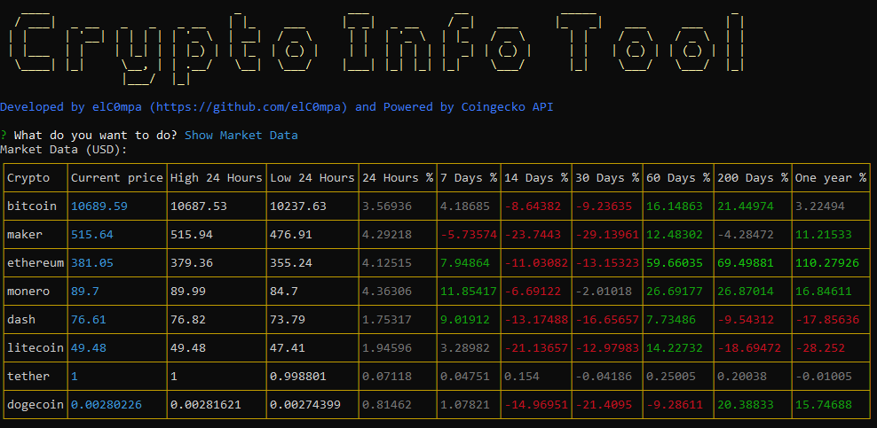

# Crypto CLI tool

Console tool created to gather crypto currencies information from Coingecko API. Its main purpose is to present market data about crypto currencies and their evolution over time.



## Main features

- Friendly console user interface
- Saves your preferences
- User can select between the 8 major currencies to show its data

## Gathered crypto currencies

- Bitcoin
- Maker
- Ethereum
- Monero
- Dash
- Litecoin
- Tether
- Dogecoin

## Installation

```javascript
npm i -g crypto-tool
```

## Basic usage

Once it has been installed, you only need to execute the CLI command:

```javascript
$ > crypto-tool
```

## Copyright

[MIT](../LICENSE.md) © [José Gabriel Companioni Benítez (elC0mpa)](https://github.com/elC0mpa)